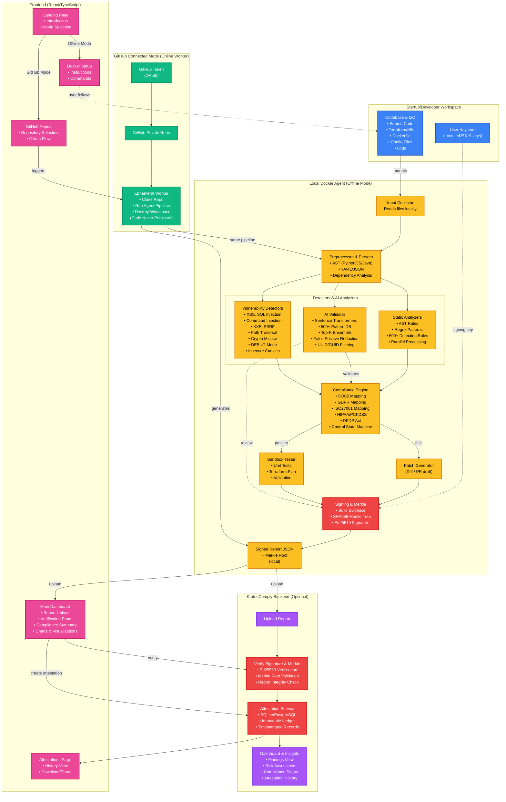
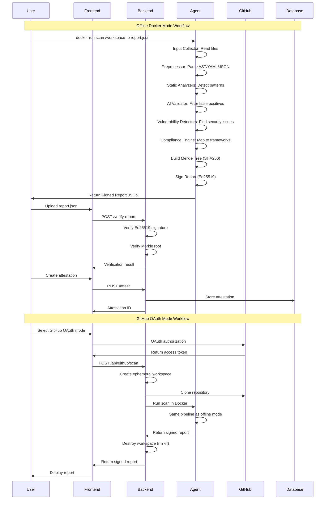

# KratosComply System Architecture (Mermaid.js)

## Complete System Architecture

## Detailed Workflow Sequence

## Component Details

### 1. Startup/Developer Workspace (Blue)
- **Codebase & IaC**: Source code, infrastructure definitions, Dockerfiles, configuration files
- **User Keystore**: Local Ed25519 keypair for cryptographic signing

### 2. Local Docker Agent (Yellow) - Offline Mode
- **Input Collector**: Reads files from mounted workspace
- **Preprocessor & Parsers**: AST parsing, YAML/JSON parsing, dependency analysis
- **Detectors & AI Analyzers**:
  - **Static Analyzers**: AST rules, regex patterns, 500+ detection rules, parallel processing
  - **AI Validator**: Sentence transformers, 500+ pattern database, top-k ensemble matching, false positive reduction, UUID/GUID filtering
  - **Vulnerability Detectors**: XSS, SQL injection, command injection, XXE, SSRF, path traversal, crypto misuse, DEBUG mode, insecure cookies
- **Compliance Engine**: Maps findings to SOC2, GDPR, ISO27001, HIPAA, PCI-DSS, DPDP Act controls
- **Patch Generator**: Generates fix patches (diffs/PR drafts)
- **Sandbox Tester**: Validates patches with unit tests, terraform plan
- **Signing & Merkle**: Builds evidence, creates SHA256 Merkle tree, signs with Ed25519

### 3. GitHub Connected Mode (Green) - Online Worker
- **Ephemeral Worker**: Clones repo, runs same agent pipeline, destroys workspace immediately
- **No Code Persistence**: Source code never stored, only signed attestation returned

### 4. KratosComply Backend (Purple) - Optional
- **Verify Signature & Merkle**: Validates Ed25519 signature and Merkle root integrity
- **Attestation Service**: Immutable ledger (SQLite/PostgreSQL) with timestamped records
- **Dashboard & Insights**: Findings view, risk assessment, compliance status, attestation history

### 5. Frontend (Pink) - React/TypeScript
- **Landing Page**: Introduction and mode selection
- **Docker Setup**: Instructions for offline mode
- **GitHub Repos**: Repository selection and OAuth flow
- **Main Dashboard**: Report upload, verification, compliance summary, charts
- **Attestations**: History view, download/share functionality

## Key Features

### Privacy-First Design
- **Offline Mode**: 100% local processing, zero data exfiltration
- **Ephemeral Workers**: Code destroyed immediately after scanning
- **No Code Storage**: Only signed attestations stored, never source code

### Cryptographic Integrity
- **Ed25519 Signatures**: Tamper-proof report signing
- **SHA256 Merkle Trees**: Evidence integrity verification
- **Immutable Ledger**: Timestamped attestation records

### AI-Powered Validation (v2.7.0)
- **500+ Pattern Database**: Real-world false positives and vulnerabilities
- **Top-K Ensemble**: Weighted matching for better generalization
- **Context-Aware**: Repository-type specific patterns
- **False Positive Reduction**: UUID/GUID filtering, security tool detection, test data filtering

### Compliance Coverage
- **SOC2**: CC6.1, CC6.2, CC7.2, CC8.1
- **GDPR**: Article 5, 6, 17, 20, 32
- **ISO27001**: A.9.2.1, A.10.1.1
- **HIPAA**: 164.308, 164.312
- **PCI-DSS**: 3.4, 8.2
- **DPDP Act**: Section 7, 8, 9
- **NIST CSF**: PR.AC-1, PR.DS-1
