# KratosComply

**Complete Compliance Operating System** - Generate audit-ready compliance evidence with cryptographic verification for SOC2, ISO27001, GDPR, DPDP Act, HIPAA, PCI-DSS, and NIST CSF compliance.

[](https://hub.docker.com/r/popslala1/kratos-agent)
[](https://www.python.org/)
[](https://www.typescriptlang.org/)

## Overview

KratosComply is a compliance-first, privacy-preserving audit automation platform that generates cryptographically verifiable compliance evidence reports. Every detection maps to specific compliance framework controls, making it suitable for auditors, investors, and regulators.

**Core Philosophy**: Compliance includes security. Every detection maps to a specific compliance control, legal requirement, or audit verifiability requirement.

## Video Demo (Screen Recording)
<video src="https://github.com/user-attachments/assets/90ffe3c4-2367-4e19-9ad1-0d457df08e2e" controls="controls" muted autoPlay loop></video>

## What's New in v2.7.0

### 🤖 Enhanced AI Validation
- **500+ Pattern Database**: Expanded from 100 to 500+ real-world patterns covering diverse repository types
- **Top-K Ensemble Matching**: Uses weighted ensemble of top-3 matches for better generalization
- **Repository-Type Awareness**: Specific patterns for security tools, educational repos, and production code
- **Improved Heuristics**: 10+ heuristic signals with weighted scoring for better context understanding
- **Better Generalization**: Handles edge cases, UUID/GUID filtering, test data detection more accurately

### 🎯 False Positive Reduction (v2.6.0)
- **UUID/GUID Filtering**: Automatically filters Visual Studio project GUIDs in `.sln`, `.csproj`, `.vcxproj` files (reduces false positives by ~95% for security tools)
- **Security Tool Detection**: Automatically detects security scanner repositories and reduces confidence for test data/examples
- **Test Data Filtering**: Intelligent detection of test data, examples, and placeholders to reduce false positives
- **Context-Aware Scanning**: Better distinction between detection patterns and actual vulnerabilities

### 🚀 Performance Improvements (v2.2.0+)
- **Parallel Processing**: 2-4x faster scans with multi-threaded file processing (configurable with `--workers`)
- **Progress Reporting**: Real-time scan progress and statistics (`--progress` flag)
- **Performance Metrics**: Detailed timing and resource usage tracking included in reports

### 📊 Export Formats
- **JSON** (default): Full report with all metadata and scan statistics
- **CSV**: Spreadsheet-friendly format for analysis and reporting
- **HTML**: Visual report with styling, charts, and severity color-coding

### 🤖 AI Enhancements (v2.1.0+)
- **100+ Known Patterns**: Comprehensive database of false positives and real vulnerabilities
- **Multi-Factor Validation**: Combines semantic similarity with heuristic analysis
- **Context-Aware Detection**: Distinguishes detector code from actual vulnerabilities
- **Industry-Specific Patterns**: HIPAA, PCI-DSS, GDPR, SOC2, ISO27001 compliance patterns
- **Confidence Scoring**: Intelligent confidence adjustment based on pattern matching

### 🔒 Security Improvements
- **Advanced XSS Detection**: Flask `|safe` filter, Django autoescape, React `dangerouslySetInnerHTML`
- **DEBUG Mode Detection**: Flask, Django, Node.js production security risks
- **Insecure Cookie Detection**: User-controlled values, missing security flags
- **Enhanced Vulnerability Coverage**: XXE, SSRF, insecure deserialization, path traversal, race conditions, crypto misuse
- **Detector Code Exclusion**: Prevents false positives from scanner code patterns

### 🛠️ Developer Experience
- **Better Error Handling**: Per-file error isolation, graceful degradation
- **Scan Statistics**: Files processed, duration, workers used (included in reports)
- **Configurable Workers**: Adjust parallel processing based on system resources
- **Multiple Export Formats**: Choose the format that works best for your workflow

## Features

### ✅ Complete Compliance Coverage

- **Technical Compliance** (Machine-verifiable): Advanced multi-technique detection using AST parsing, dependency analysis, API route analysis, database schema analysis, configuration parsing, and regex patterns. Detects hardcoded secrets (including cloud provider credentials), insecure ACLs, SQL injection risks, unencrypted database connections, API authentication gaps, container security issues, CI/CD vulnerabilities, and dependency compliance issues.
- **System Compliance** (Configuration-verifiable): Configuration detection for logging, retention, encryption, MFA, backup policies, and cloud provider security settings (AWS CloudTrail, S3 encryption, IAM MFA, GCP/Azure equivalents).
- **Procedural Compliance** (Human-attested): Signed attestations for non-technical controls with Ed25519 signatures

### ✅ Industry-Grade Security Detection

**Advanced Vulnerability Detection:**
- **XSS Vulnerabilities**: Flask/Jinja2 `|safe` filter, Django autoescape, React `dangerouslySetInnerHTML`
- **Command Injection**: `system()`, `exec()`, `eval()` with user input
- **SQL/NoSQL Injection**: String concatenation, parameterized query detection
- **XXE (XML External Entity)**: XML parser vulnerabilities
- **SSRF (Server-Side Request Forgery)**: User-controlled URL fetching
- **Insecure Deserialization**: `pickle.loads()`, `yaml.load()` with user input
- **Path Traversal**: Directory traversal vulnerabilities (`../`)
- **Race Conditions**: TOCTOU (Time-of-Check-Time-of-Use) vulnerabilities
- **Cryptographic Misuse**: Weak random number generation, hardcoded IVs, weak key derivation
- **DEBUG Mode Detection**: Flask, Django, Node.js production security risks
- **Insecure Cookie Handling**: User-controlled cookie values, missing security flags

**Infrastructure Security:**
- **Terraform Security**: Unencrypted storage, exposed secrets, missing version constraints, wildcard IAM policies
- **Kubernetes Security**: Privileged containers, host network mode, missing resource limits, Docker socket exposure
- **Container Security**: Root user execution, missing security contexts
- **CI/CD Security**: Hardcoded secrets, unsigned artifacts, unpinned Docker images, missing security scanning

### ✅ False Positive Reduction (v2.6.0+)

- **UUID/GUID Filtering**: Automatically excludes Visual Studio project GUIDs from secret detection
- **Security Tool Detection**: Reduces false positives when scanning security scanner repositories (trivy, grype, etc.)
- **Test Data Filtering**: Filters out test data, examples, and placeholders from secret detection
- **Context-Aware Detection**: Better distinction between detection patterns and actual vulnerabilities

### ✅ AI-Powered Validation (v2.7.0+)

- **Offline AI Validation**: Uses sentence transformers for semantic similarity matching (no API calls)
- **500+ Known Patterns**: Comprehensive database expanded with real-world examples from diverse repositories
- **Top-K Ensemble Matching**: Weighted ensemble of top-3 matches for robust generalization
- **Multi-Factor Validation**: Combines semantic similarity with 10+ heuristic signals
- **Context-Aware Detection**: Distinguishes detector code, test data, and actual vulnerabilities
- **Repository-Type Awareness**: Specific patterns for security tools, educational repos, production code
- **Confidence Scoring**: Intelligent confidence adjustment with ensemble voting
- **Industry-Specific Patterns**: HIPAA, PCI-DSS, GDPR, SOC2, ISO27001 compliance patterns
- **UUID/GUID Filtering**: Automatically filters Visual Studio project GUIDs
- **Test Data Detection**: Intelligent filtering of test fixtures, mocks, and examples

### ✅ Performance & Scalability (v2.2.0+)

- **Parallel Processing**: Multi-threaded file scanning (2-4x faster on large codebases)
- **Progress Reporting**: Real-time scan progress and statistics
- **Performance Metrics**: Scan duration, files processed, error tracking
- **Multiple Export Formats**: JSON (default), CSV, HTML reports
- **Error Resilience**: Per-file error isolation, graceful degradation
- **Scan Statistics**: Detailed metrics included in all reports

### ✅ Cryptographic Integrity

- Ed25519 signatures for all reports and attestations
- SHA256 Merkle trees for evidence binding
- Tamper-proof audit trail
- Canonical JSON serialization for deterministic hashing

### ✅ Compliance Frameworks

- **SOC2**: CC6.1 (Access Control), CC6.2 (Secrets Management), CC7.2 (Logging), CC7.3 (Incident Response), CC8.1 (Vendor Risk)
- **ISO27001**: A.9.2.1 (Access Management), A.10.1.1 (Encryption)
- **DPDP Act (India)**: Section 7 (Consent), Section 8 (Retention), Section 9 (Access Logging)
- **GDPR (EU)**: Article 5 (Retention), Article 6 (Consent), Article 17 (Erasure), Article 20 (Portability), Article 32 (Encryption)
- **HIPAA**: 164.308 (Access Control), 164.312 (Encryption)
- **PCI-DSS**: 3.4 (PAN Protection), 8.2 (Strong Authentication)
- **NIST CSF**: PR.AC-1 (Identity Management), PR.DS-1 (Data Protection)

### ✅ Control State Machine

Every control resolves to exactly one state:
- `VERIFIED_MACHINE` - Machine-verified code evidence
- `VERIFIED_SYSTEM` - Configuration-verified system evidence
- `ATTESTED_HUMAN` - Human-signed attestation
- `MISSING_EVIDENCE` - Evidence gap identified
- `EXPIRED_EVIDENCE` - Time-scoped evidence expired

### ✅ Privacy-Preserving

- **Offline-First Agent**: Scans codebases locally, no source code leaves your environment
- **Ephemeral GitHub Workers**: GitHub OAuth scans use temporary workspaces that are destroyed after attestation generation
- **No Code Persistence**: Source code never stored, only compliance attestations

## Architecture

### System Architecture

```mermaid
graph TB
    subgraph "Startup/Developer Workspace"
        Codebase["Codebase & IaC<br/>• Source Code<br/>• Terraform/K8s<br/>• Dockerfile<br/>• Config Files<br/>• Logs"]
        Keystore["User Keystore<br/>(Local ed25519 keys)"]
    end

    subgraph "Local Docker Agent (Offline Mode)"
        InputCollector["Input Collector<br/>Reads files locally"]
        Preprocessor["Preprocessor & Parsers<br/>• AST (Python/JS/Java)<br/>• YAML/JSON<br/>• Dependency Analysis"]
        
        subgraph "Detectors & AI Analyzers"
            StaticAnalyzers["Static Analyzers<br/>• AST Rules<br/>• Regex Patterns<br/>• 500+ Detection Rules<br/>• Parallel Processing"]
            MLClassifiers["AI Validator<br/>• Sentence Transformers<br/>• 500+ Pattern DB<br/>• Top-K Ensemble<br/>• False Positive Reduction<br/>• UUID/GUID Filtering"]
            VulnerabilityDetectors["Vulnerability Detectors<br/>• XSS, SQL Injection<br/>• Command Injection<br/>• XXE, SSRF<br/>• Path Traversal<br/>• Crypto Misuse<br/>• DEBUG Mode<br/>• Insecure Cookies"]
        end
        
        ComplianceEngine["Compliance Engine<br/>• SOC2 Mapping<br/>• GDPR Mapping<br/>• ISO27001 Mapping<br/>• HIPAA/PCI-DSS<br/>• DPDP Act<br/>• Control State Machine"]
        
        PatchGenerator["Patch Generator<br/>(Diff / PR draft)"]
        SandboxTester["Sandbox Tester<br/>• Unit Tests<br/>• Terraform Plan<br/>• Validation"]
        
        SigningMerkle["Signing & Merkle<br/>• Build Evidence<br/>• SHA256 Merkle Tree<br/>• Ed25519 Signature"]
        
        ReportOutput["Signed Report JSON<br/>+ Merkle Root<br/>(local)"]
    end

    subgraph "GitHub Connected Mode (Online Worker)"
        GitHubToken["GitHub Token<br/>(OAuth)"]
        GitHubRepo["GitHub Private Repo"]
        EphemeralWorker["Ephemeral Worker<br/>• Clone Repo<br/>• Run Agent Pipeline<br/>• Destroy Workspace<br/>(Code Never Persisted)"]
    end

    subgraph "KratosComply Backend (Optional)"
        Upload["Upload Report"]
        VerifySig["Verify Signature & Merkle<br/>• Ed25519 Verification<br/>• Merkle Root Validation<br/>• Report Integrity Check"]
        AttestationService["Attestation Service<br/>• SQLite/PostgreSQL<br/>• Immutable Ledger<br/>• Timestamped Records"]
        Dashboard["Dashboard & Insights<br/>• Findings View<br/>• Risk Assessment<br/>• Compliance Status<br/>• Attestation History"]
    end

    subgraph "Frontend (React/TypeScript)"
        LandingPage["Landing Page<br/>• Introduction<br/>• Mode Selection"]
        DockerSetup["Docker Setup<br/>• Instructions<br/>• Commands"]
        GitHubRepos["GitHub Repos<br/>• Repository Selection<br/>• OAuth Flow"]
        MainDashboard["Main Dashboard<br/>• Report Upload<br/>• Verification Panel<br/>• Compliance Summary<br/>• Charts & Visualizations"]
        Attestations["Attestations Page<br/>• History View<br/>• Download/Share"]
    end

    %% Workflow connections
    Codebase -->|mounts| InputCollector
    Keystore -.->|signing key| SigningMerkle
    
    InputCollector --> Preprocessor
    Preprocessor --> StaticAnalyzers
    Preprocessor --> MLClassifiers
    Preprocessor --> VulnerabilityDetectors
    
    StaticAnalyzers --> ComplianceEngine
    MLClassifiers -->|validates| ComplianceEngine
    VulnerabilityDetectors --> ComplianceEngine
    
    ComplianceEngine -->|fails| PatchGenerator
    ComplianceEngine -->|passes| SandboxTester
    
    PatchGenerator --> SigningMerkle
    SandboxTester --> SigningMerkle
    MLClassifiers -.->|review| SigningMerkle
    
    SigningMerkle --> ReportOutput
    
    %% GitHub OAuth Flow
    GitHubToken --> GitHubRepo
    GitHubRepo --> EphemeralWorker
    EphemeralWorker -->|same pipeline| Preprocessor
    EphemeralWorker -->|generates| ReportOutput
    
    %% Backend Flow
    ReportOutput -->|upload| Upload
    Upload --> VerifySig
    VerifySig --> AttestationService
    AttestationService --> Dashboard
    
    %% Frontend Flow
    LandingPage -->|Offline Mode| DockerSetup
    LandingPage -->|GitHub Mode| GitHubRepos
    DockerSetup -.->|user follows| Codebase
    GitHubRepos -->|triggers| EphemeralWorker
    ReportOutput -->|upload| MainDashboard
    MainDashboard -->|verify| VerifySig
    MainDashboard -->|create attestation| AttestationService
    AttestationService --> Attestations
    
    %% Styling
    classDef workspace fill:#3b82f6,stroke:#1e40af,stroke-width:2px,color:#fff
    classDef agent fill:#fbbf24,stroke:#d97706,stroke-width:2px,color:#000
    classDef github fill:#10b981,stroke:#059669,stroke-width:2px,color:#fff
    classDef backend fill:#a855f7,stroke:#7c3aed,stroke-width:2px,color:#fff
    classDef frontend fill:#ec4899,stroke:#be185d,stroke-width:2px,color:#fff
    classDef critical fill:#ef4444,stroke:#dc2626,stroke-width:3px,color:#fff
    
    class Codebase,Keystore workspace
    class InputCollector,Preprocessor,StaticAnalyzers,MLClassifiers,VulnerabilityDetectors,ComplianceEngine,PatchGenerator,SandboxTester,SigningMerkle,ReportOutput agent
    class GitHubToken,GitHubRepo,EphemeralWorker github
    class Upload,VerifySig,AttestationService,Dashboard backend
    class LandingPage,DockerSetup,GitHubRepos,MainDashboard,Attestations frontend
    class SigningMerkle,VerifySig,AttestationService critical
```



### Data Flow


### Compliance Control Flow


### Component Architecture


## Quick Start

### Docker Compose (Recommended)

```bash
# Clone repository
git clone <repository-url>
cd KratosCompliance

# Start all services
docker-compose up --build

# Services will be available at:
# - Frontend: http://localhost:5173
# - Backend: http://localhost:8000
# - Backend API docs: http://localhost:8000/docs
```

### Using Docker Hub Agent

```bash
# Pull the official image
docker pull popslala1/kratos-agent:latest

# Generate keys (mount a local directory for key storage)
docker run --rm -v $(pwd)/keys:/root/.kratos/keys popslala1/kratos-agent:latest generate-key

# Basic scan
docker run --rm \
  -v $(pwd)/keys:/root/.kratos/keys \
  -v $(pwd)/project:/workspace \
  -v $(pwd)/output:/output \
  popslala1/kratos-agent:latest scan /workspace --output /output/report.json

# Scan with progress reporting and parallel processing
docker run --rm \
  -v $(pwd)/keys:/root/.kratos/keys \
  -v $(pwd)/project:/workspace \
  -v $(pwd)/output:/output \
  popslala1/kratos-agent:latest scan /workspace \
    --output /output/report.json \
    --workers 8 \
    --progress

# Export as CSV
docker run --rm \
  -v $(pwd)/keys:/root/.kratos/keys \
  -v $(pwd)/project:/workspace \
  -v $(pwd)/output:/output \
  popslala1/kratos-agent:latest scan /workspace \
    --output /output/report.csv \
    --format csv

# Export as HTML
docker run --rm \
  -v $(pwd)/keys:/root/.kratos/keys \
  -v $(pwd)/project:/workspace \
  -v $(pwd)/output:/output \
  popslala1/kratos-agent:latest scan /workspace \
    --output /output/report.html \
    --format html \
    --progress
```

### Manual Setup

#### 1. Backend Setup

```bash
cd backend
python3 -m venv venv
source venv/bin/activate  # On Windows: .venv\Scripts\activate
pip install -e .
uvicorn main:app --reload
```

Backend will run at `http://localhost:8000`

#### 2. Frontend Setup

```bash
cd frontend
npm install
npm run dev
```

Frontend will run at `http://localhost:5173`

#### 3. Agent Setup

```bash
cd agent
python3 -m venv venv
source venv/bin/activate  # On Windows: venv\Scripts\activate
pip install -r requirements.txt

# Generate cryptographic keypair
python -m agent.cli generate-key

# Scan a project
python -m agent.cli scan /path/to/project --output report.json
```

## Usage

### 1. Generate Keys

First, generate a cryptographic keypair for signing reports:

```bash
# Using Docker
docker run --rm -v $(pwd)/keys:/root/.kratos/keys popslala1/kratos-agent:latest generate-key

# Or locally
cd agent
source venv/bin/activate
python -m agent.cli generate-key
```

Keys are stored in `~/.kratos/keys/` by default.

### 2. Scan Your Project

```bash
# Using Docker (basic)
docker run --rm \
  -v $(pwd)/keys:/root/.kratos/keys \
  -v $(pwd)/project:/workspace \
  -v $(pwd)/output:/output \
  popslala1/kratos-agent:latest scan /workspace --output /output/report.json

# Using Docker (with all features)
docker run --rm \
  -v $(pwd)/keys:/root/.kratos/keys \
  -v $(pwd)/project:/workspace \
  -v $(pwd)/output:/output \
  popslala1/kratos-agent:latest scan /workspace \
    --output /output/report.json \
    --workers 8 \
    --progress \
    --format json

# Or locally
python -m agent.cli scan /path/to/your/project \
    --output report.json \
    --project-name "your-project" \
    --workers 4 \
    --progress \
    --format json
```

**Scan Options:**
- `--workers N`: Number of parallel workers (default: 4, recommended: 4-8)
- `--progress`: Show real-time progress indicators
- `--format json|csv|html`: Export format (default: json)
- `--generate-patches`: Generate auto-fix patches for supported findings
- `--patches-dir PATH`: Directory for patch files

The scan will:
- **Detect code-level compliance issues**: Uses advanced multi-technique detection (AST analysis, dependency checking, API route parsing, database schema analysis) to find hardcoded secrets (including cloud provider credentials), insecure ACLs, SQL injection risks, unencrypted database connections, API authentication gaps, consent handling mechanisms, data portability endpoints, access logging implementations, and right-to-erasure functionality
- **Advanced security vulnerabilities**: XSS (including Flask `|safe`, Django autoescape, React), command injection, XXE, SSRF, insecure deserialization, path traversal, race conditions, cryptographic misuse, DEBUG mode, insecure cookies
- **Infrastructure-as-Code security**: Terraform/CloudFormation misconfigurations (public S3 buckets, unencrypted RDS, open security groups, wildcard IAM policies)
- **Container security**: Docker and Kubernetes security issues (root user, missing security contexts, secrets in manifests, Docker socket exposure)
- **CI/CD pipeline security**: Secrets in workflows, unsigned artifacts, unpinned Docker images, missing security scanning
- **Dependency compliance**: Missing lock files, unpinned dependencies, compliance library detection (Supabase, Auth0, etc.)
- **AI-powered validation**: Semantic similarity matching to filter false positives and boost confidence for real issues (100+ known patterns)
- **Parallel processing**: Multi-threaded scanning for 2-4x faster performance on large codebases
- **Collect system-level evidence**: Logging, encryption, MFA configs, AWS CloudTrail, S3 encryption, IAM MFA, retention policies
- **Map findings to compliance controls**: All findings mapped to specific framework controls across all 7 supported frameworks
- **Generate cryptographic evidence hashes**: SHA256 hashes for all evidence
- **Create a Merkle root**: Cryptographic proof of report integrity
- **Performance metrics**: Scan duration, files processed, error tracking included in reports

### 3. Upload & Verify

1. Open the frontend at `http://localhost:5173`
2. Upload the generated `report.json`
3. Enter your public key (get it with: `cat ~/.kratos/keys/pub.key` or `docker run --rm -v $(pwd)/keys:/root/.kratos/keys popslala1/kratos-agent:latest public-key`)
4. Verify the report signature
5. Create an attestation

### 4. Human Attestations (Procedural Controls)

For controls that require human attestation (policies, training records, incident response procedures):

```bash
# Upload evidence file
curl -X POST http://localhost:8000/api/human/upload \
  -F "file=@policy.pdf" \
  -F "control_id=CC7.3" \
  -F "framework=SOC2"

# Create signed attestation
curl -X POST http://localhost:8000/api/human/attest \
  -H "Content-Type: application/json" \
  -d '{
    "control_id": "CC7.3",
    "framework": "SOC2",
    "attester_name": "John Doe",
    "attester_email": "john@example.com",
    "evidence_hash": "...",
    "declaration": "Incident response procedures are documented and tested quarterly."
  }'
```

## Project Structure

```
KratosCompliance/
├── agent/              # Compliance evidence scanner (Python)
│   ├── agent/         # Core agent code
│   │   ├── cli.py     # CLI interface
│   │   ├── detectors.py  # Compliance violation detectors
│   │   ├── compliance.py  # Compliance control mappings
│   │   ├── control_model.py  # Control definitions
│   │   ├── reporting.py  # Report generation
│   │   ├── signature.py  # Ed25519 signing
│   │   ├── merkle.py  # Merkle tree builder
│   │   └── system_evidence.py  # System evidence collection
│   ├── Dockerfile     # Docker image definition
│   ├── build-docker.sh  # Build script
│   └── requirements.txt
│
├── backend/            # FastAPI backend (Python)
│   ├── main.py        # FastAPI application
│   ├── models.py      # SQLAlchemy models
│   ├── schemas.py     # Pydantic schemas
│   ├── security.py    # Cryptographic verification
│   ├── database.py    # Database utilities
│   ├── github_service.py  # GitHub OAuth integration
│   └── tests/         # Backend tests
│
├── frontend/           # React frontend (TypeScript)
│   ├── src/
│   │   ├── pages/     # Page components
│   │   ├── components/  # Reusable components
│   │   ├── services/  # API client
│   │   └── types/     # TypeScript types
│   └── package.json
│
├── docker-compose.yml  # Development setup
└── docker-compose.prod.yml  # Production setup
```

## API Documentation

### Backend API Endpoints

#### Report Verification

```http
POST /api/verify
Content-Type: application/json

{
  "report": { ... },
  "public_key": "hex_string"
}
```

#### Attestation Creation

```http
POST /api/attest
Content-Type: application/json

{
  "report_id": "uuid",
  "attester_name": "John Doe",
  "attester_email": "john@example.com"
}
```

#### Human Attestations

```http
POST /api/human/upload
Content-Type: multipart/form-data

file: <file>
control_id: "CC7.3"
framework: "SOC2"

POST /api/human/attest
Content-Type: application/json

{
  "control_id": "CC7.3",
  "framework": "SOC2",
  "attester_name": "John Doe",
  "evidence_hash": "...",
  "declaration": "..."
}
```

Full API documentation available at `http://localhost:8000/docs` when the backend is running.

## Compliance Frameworks

### SOC2 (Service Organization Control 2)

- **CC6.1**: Logical and physical access controls
- **CC6.2**: Prior to issuing system credentials and granting system access
- **CC7.2**: The entity monitors system components and the operation of those components
- **CC7.3**: The entity evaluates security events
- **CC8.1**: The entity authorizes, designs, develops, configures, documents, tests, approves, and implements changes to infrastructure, data, software, and procedures

### ISO27001

- **A.9.2.1**: User registration and de-registration
- **A.10.1.1**: Cryptographic controls

### GDPR (General Data Protection Regulation)

- **Article 5**: Principles relating to processing of personal data
- **Article 6**: Lawfulness of processing
- **Article 17**: Right to erasure ('right to be forgotten')
- **Article 20**: Right to data portability
- **Article 32**: Security of processing

### DPDP Act (India)

- **Section 7**: Consent
- **Section 8**: Retention
- **Section 9**: Access Logging

### HIPAA (Health Insurance Portability and Accountability Act)

- **164.308**: Administrative safeguards (Access Control)
- **164.312**: Technical safeguards (Encryption)

### PCI-DSS (Payment Card Industry Data Security Standard)

- **3.4**: Render PAN unreadable anywhere it is stored
- **8.2**: In addition to assigning a unique ID, employ at least one of the following methods to authenticate all users

### NIST Cybersecurity Framework

- **PR.AC-1**: Identities and credentials are issued, managed, verified, revoked, and audited
- **PR.DS-1**: Data-at-rest is protected

## Verification Methods

### Machine-Verified
Fully automated verification using advanced multi-technique detection:

1. **AST-Based Function Call Analysis**: Analyzes actual function calls, imports, and decorators in code (e.g., `consent_handler()`, `@require_consent`, `export_user_data()`)
2. **Dependency/Library Analysis**: Detects compliance features via installed packages (e.g., Supabase, Auth0 provide built-in GDPR features)
3. **API Route/Endpoint Analysis**: Parses actual API routes to detect compliance endpoints (e.g., `/api/consent`, `/api/export-data`, `/api/delete-account`)
4. **Database Schema Analysis**: Analyzes migrations and schemas for compliance fields (e.g., `consent` table, `audit_log` table, `deleted_at` column)
5. **Configuration File Parsing**: Parses YAML/JSON/TOML configs for compliance settings (e.g., `retention: { days: 90 }`, `audit: { enabled: true }`)
6. **Environment Variable Analysis**: Checks for compliance-related env vars (e.g., `ENABLE_AUDIT_LOGGING=true`, `DATA_RETENTION_DAYS=90`)
7. **Middleware/Decorator Analysis**: Detects compliance via decorators and middleware patterns
8. **Regex Pattern Matching**: Traditional pattern matching for secrets, ACLs, and security misconfigurations

**Benefits**: Lower false positive rate, detects actual implementations (not just keywords), works with different naming conventions, detects compliance handled by external services.

Examples: hardcoded secrets, insecure ACLs, consent handling code, data portability endpoints, access logging implementations.

### System-Verified
Configuration detection (flags, settings). Examples: logging enabled, retention duration, encryption settings, MFA configuration, AWS CloudTrail logging, S3 encryption, IAM MFA enforcement.

### Human-Attested
Requires human declaration with cryptographic signature. Examples: incident response procedures, access review policies, training records, vendor risk assessments.

**Important**: KratosComply does NOT claim "full automation" for compliance. Many controls require human attestation. The system clearly distinguishes between machine-verified, system-verified, and human-attested evidence.

## Report Structure

```json
{
  "report_version": "1.0",
  "project": {
    "name": "my-project",
    "path": "/path/to/project",
    "commit": "abc123",
    "scan_time": "2025-12-30T09:00:00Z"
  },
  "standards": ["SOC2", "ISO27001", "GDPR", "DPDP", "HIPAA", "PCI-DSS", "NIST-CSF"],
  "findings": [
    {
      "id": "F001",
      "type": "hardcoded_secret",
      "file": "config.py",
      "line": 42,
      "severity": "high",
      "compliance_frameworks_affected": ["SOC2", "ISO27001"],
      "control_id": "SOC2-CC6.2",
      "control_state": "MISSING_EVIDENCE",
      "evidence_hash": "..."
    }
  ],
  "system_evidence": [
    {
      "control_id": "SOC2-CC7.2",
      "framework": "SOC2",
      "evidence_type": "config_proof",
      "evidence_present": true,
      "evidence_source": "logging.yaml"
    }
  ],
  "control_states": {
    "SOC2-CC6.2": "MISSING_EVIDENCE",
    "SOC2-CC7.2": "VERIFIED_SYSTEM"
  },
  "merkle_root": "sha256_hash",
  "agent_signature": "ed25519_signature",
  "agent_version": "kratos-comply-agent-2.2.0",
  "scan_statistics": {
    "total_findings": 42,
    "scan_duration_seconds": 15.3,
    "workers_used": 4,
    "files_scanned": 1250
  }
}
```

**Note**: The `scan_statistics` field is available in v2.2.0+ reports and includes performance metrics from parallel scanning.

## Development

### Running Tests

```bash
# Backend tests
cd backend
pytest

# Agent tests
cd agent
pytest
```

### Building Docker Images

```bash
# Agent image
cd agent
./build-docker.sh

# Backend image
cd backend
docker build -t kratos-backend .

# Frontend image
cd frontend
docker build -t kratos-frontend .
```

## Contributing

Contributions are welcome! Please ensure:

1. All tests pass
2. Code follows existing style conventions
3. New compliance controls are properly documented
4. Cryptographic operations are tested

## License

MIT License - see LICENSE file for details

## Version History

### v2.2.0 (Current) - Performance & Export Formats
- ✅ Parallel file processing (2-4x faster scans)
- ✅ Multiple export formats (JSON, CSV, HTML)
- ✅ Progress reporting and scan statistics
- ✅ Enhanced error handling and resilience
- ✅ Performance metrics in reports

### v2.1.0 - Advanced AI Validation
- ✅ AI-powered validation with 100+ known patterns
- ✅ Multi-factor validation (semantic similarity + heuristics)
- ✅ Context-aware detection (distinguishes detector code from vulnerabilities)
- ✅ Industry-specific compliance patterns (HIPAA, PCI-DSS, GDPR, SOC2, ISO27001)
- ✅ Improved confidence scoring

### v2.0.0 - Industry-Grade Security Detection
- ✅ 15+ cloud provider secret patterns
- ✅ 6 new vulnerability types (XXE, SSRF, insecure deserialization, path traversal, race conditions, crypto misuse)
- ✅ Enhanced CI/CD and IAC security (Terraform, Kubernetes, Docker)
- ✅ 25+ programming languages supported
- ✅ Detector code exclusion to reduce false positives

## Support

For issues, questions, or contributions, please open an issue on the repository.

---

**KratosComply** - Making compliance verifiable, one control at a time.

**Current Version**: 2.7.0 | **Docker Image**: `popslala1/kratos-agent:latest` | **Multi-Arch**: AMD64 + ARM64
